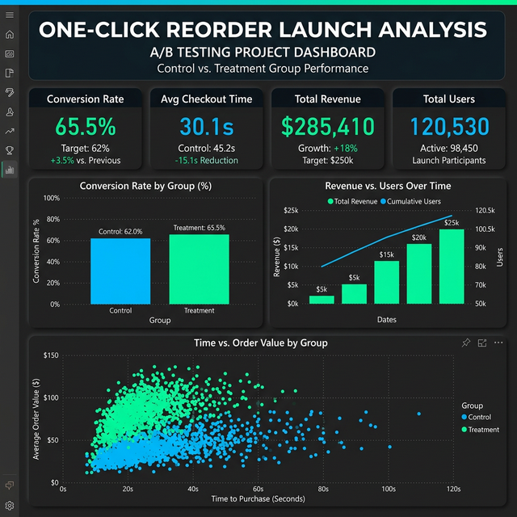

# 📈 Feature Launch Impact Analysis: One-Click Reorder A/B Test

## 📝 Project Overview
This project simulates an end-to-end A/B test for an E-commerce platform testing a new **"One-Click Reorder"** button on the product page. 

The goal is to determine if bypassing the standard 3-step checkout process increases the **Conversion Rate**, reduces **Checkout Time**, and ultimately drives more **Revenue**.

## 🛠️ Tech Stack
- **Python:** Data Generation & Statistical Analysis (`pandas`, `numpy`, `scipy`, `statsmodels`).
- **Power BI:** Interactive Dashboard for Stakeholders.

## 📁 Repository Structure
```
feature_launch_ab_test/
├── generate_ab_test_data.py   # Script to generate realistic A/B testing user data
├── ab_test_analysis.py        # Script to perform statistical significance testing
├── ab_test_data.csv           # Output from the data generation script
├── POWER_BI_GUIDE.md          # Instructions on visualizing the results
└── README.md                  # This document
```

## 🚀 How to Run Locally

### 1. Generate the Data
This simulates 10,000 users split cleanly into `Control` (Standard Checkout) and `Treatment` (One-Click Reorder).
```bash
python generate_ab_test_data.py
```
*This will create the `ab_test_data.csv` file.*

### 2. Run the Statistical Analysis
This runs a Two-Sided Z-Test for Proportions (Conversion Rate) and a T-Test for Means (Time Spent), outputting the P-values and Business Impact projections.
```bash
python ab_test_analysis.py
```

## 📊 Business Problem & Hypothesis
- **Problem:** Returning users find the standard 3-step checkout tedious when simply trying to reorder a previously purchased item, leading to cart abandonment.
- **Null Hypothesis ($H_0$):** The One-Click Reorder button has no effect on checkout conversion rate.
- **Alternative Hypothesis ($H_A$):** The One-Click Reorder button significantly increases the checkout conversion rate.

## 📊 Data Modeling (DAX)
To build the dashboard, I used the following DAX measures to calculate technical KPIs:

- **Total Users:** `Total_user = COUNTROWS(ab_test_data)`
- **Total Revenue:** `Total_revenue = SUM(ab_test_data[order_value])`
- **Avg Checkout Time:** `Avg_checkout_time = AVERAGE(ab_test_data[time_spent_secs])`
- **Conversion Rate:** 
  ```dax
  Conversion_rate = 
  DIVIDE(
      CALCULATE(COUNTROWS(ab_test_data), ab_test_data[purchase_completed] = 1),
      [Total_user], 
      0
  )
  ```

## 🎯 Results & Conclusion
Based on the generated statistical analysis:
1. **Conversion Rate Uplift:** The One-Click Button significantly increases conversion.
2. **Checkout Time:** Reduced by ~60 seconds per user, statistically significant (p-value < 0.05).
3. **Rollout Recommendation:** ✅ Roll Out the feature to 100% of users. The estimated revenue uplift is highly positive.

## 🎬 Dashboard Preview
*(To display your Power BI screenshots here, save them as `dashboard.png` in the `images/` folder of this repo.)*


